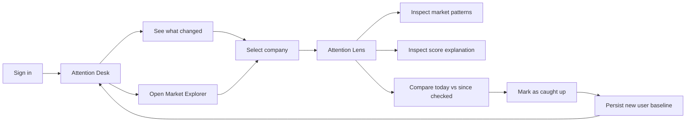
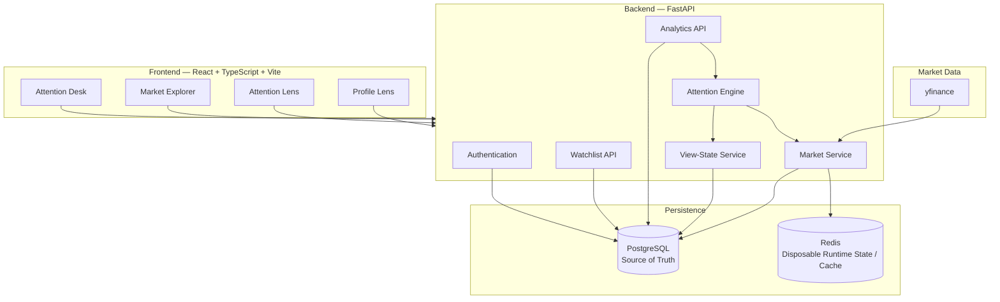
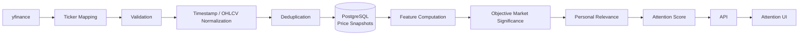
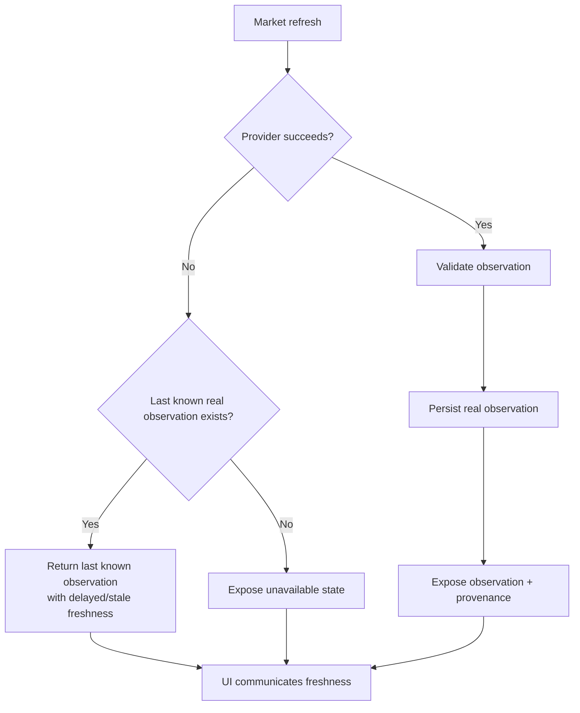
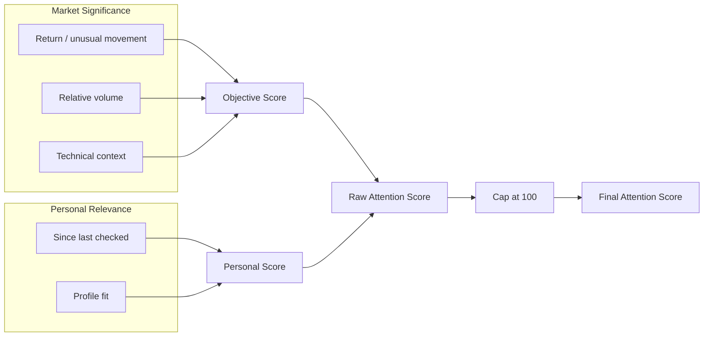
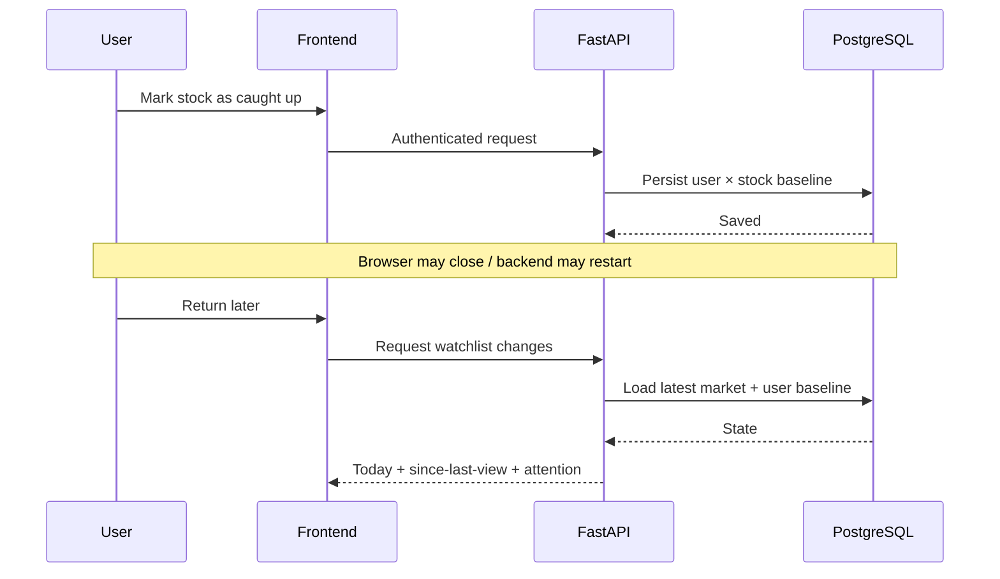
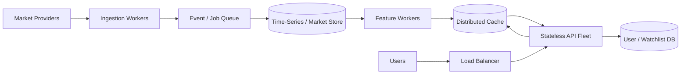
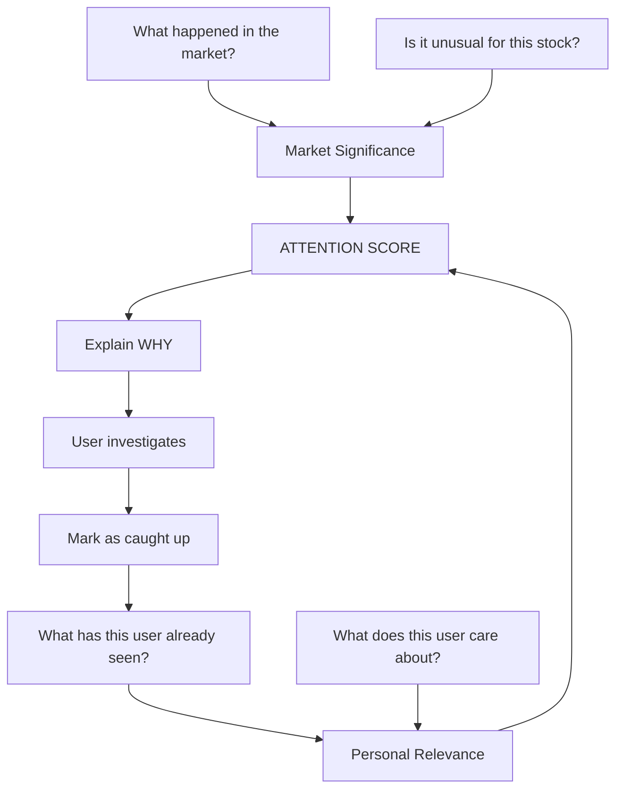

# Smart Watchlist

> **A market watchlist that remembers what you saw, measures what changed, and helps decide what deserves attention now.**

Smart Watchlist is an end-to-end market monitoring system built for **CODE 2026 by Groww**.

Traditional watchlists answer:

> **“What is the market doing?”**

Smart Watchlist is designed around a different question:

> **“What changed meaningfully since I last checked — and which of those changes matter to me?”**

Instead of treating every price movement equally, the system combines:

- objective market significance,
- abnormal movement relative to historical behaviour,
- volume and technical context,
- changes since the user's last view,
- and the user's investment preferences.

The result is an explainable **Attention Score** rather than another wall of green and red percentages.

---

# 100-Word Product Pitch

Smart Watchlist turns a passive stock list into a personalized attention system. Instead of asking users to repeatedly scan prices, it remembers what they last saw and identifies what changed meaningfully since then. Real market observations are persisted with provenance and freshness, while an explainable scoring engine separates objective market significance from personal relevance. Two contrasting investor profiles demonstrate why the same market event can deserve different levels of attention. Users can inspect every signal, explore historical patterns, understand score decomposition, and explicitly mark themselves caught up. The result is a watchlist designed around attention, context, transparency, and responsible decision support.

---

# The Problem

A conventional watchlist usually looks something like:

```text
RELIANCE      ₹1,322.00      +1.50%
TCS           ₹2,304.00      -0.69%
HDFCBANK        ₹712.10      +0.77%
```

This is useful market information, but it leaves most of the reasoning to the user.

A user returning after several hours or several days still has to determine:

1. What changed since I personally last checked?
2. Is today's move actually unusual for this stock?
3. Is unusual volume accompanying the move?
4. Is the stock near an important recent level?
5. Is this worth *my* attention?
6. Why did the application decide that?

Smart Watchlist makes those questions part of the system itself.

---

# Product Thesis

The central design decision is:

> **A watchlist should optimize for attention, not information density alone.**

Markets generate far more information than a user can reasonably process.

Therefore:

```text
Market data
    ↓
Market context
    ↓
Meaningful-change detection
    ↓
Personal relevance
    ↓
Explainable attention
```

The system deliberately avoids making buy/sell recommendations.

It answers:

> **“What deserves another look?”**

not:

> **“What should I trade?”**

That distinction is important for both product responsibility and system design.

---

# What Makes Smart Watchlist Different

## 1. It remembers the user's market context

For each watched company, the application can persist the price associated with the user's last meaningful view.

That enables:

```text
TODAY
+1.50%

SINCE YOU CHECKED
+4.70%
```

These are different questions.

**Today's move** compares the market with its session reference.

**Since you checked** compares the current observation with the user's persisted baseline.

A conventional watchlist generally understands the first.

Smart Watchlist also models the second.

---

## 2. Market significance and personal relevance are separate concepts

A large market event should not become objectively more significant merely because a user prefers momentum investing.

Therefore the scoring architecture separates:

```text
MARKET SIGNIFICANCE
        +
PERSONAL RELEVANCE
        ↓
ATTENTION SCORE
```

This distinction makes personalization explainable.

Two users can observe the **same market facts** while receiving different attention prioritization.

---

## 3. Historical behaviour provides context

A 2% move does not mean the same thing for every stock.

Instead of treating absolute percentage movement as the entire signal, historical observations allow the system to evaluate characteristics such as:

- recent returns,
- normal volatility,
- abnormal return magnitude,
- relative volume,
- recent highs,
- distance from recent highs,
- and multi-session behaviour.

The system therefore asks:

> **“Is this movement unusual for this company?”**

rather than simply:

> **“Did this company move?”**

---

## 4. Every attention decision is inspectable

The user can open the **Attention Lens** for a company and inspect the factors contributing to its score.

The UI deliberately separates:

- market facts,
- historical context,
- personal context,
- score components,
- final score,
- and any applied score cap.

The frontend does **not independently invent the score**.

Scoring remains a backend responsibility.

---

# Core User Journey



The goal is to make the common workflow:

```text
Open → Understand → Investigate → Catch up
```

rather than:

```text
Open → Scan everything → Remember old values → Manually infer importance
```

---

# System Architecture

Smart Watchlist is implemented as a full-stack system with separate responsibilities for presentation, application logic, persistence, caching and external market data.



---

# Why This Architecture?

## React + TypeScript

The frontend is intentionally a client application rather than server-rendered HTML.

React makes the different analytical surfaces composable while TypeScript gives API contracts compile-time validation.

The frontend is responsible for:

- navigation,
- interaction,
- visualization,
- filtering,
- loading/error states,
- accessibility,
- and presentation.

It is **not** the authoritative source for financial calculations.

That remains on the backend.

---

## FastAPI

FastAPI provides the application boundary for:

- authentication,
- watchlists,
- market observations,
- analytics,
- user profiles,
- view state,
- and health checks.

The service layer keeps domain behaviour away from route handlers so that scoring and market logic can be tested independently of HTTP.

---

## PostgreSQL as Source of Truth

Market observations and user-specific state must survive:

- refreshes,
- backend restarts,
- browser sessions,
- and device changes.

Therefore durable state belongs in PostgreSQL.

Examples include:

```text
Users
Profiles
Stocks
Watchlist memberships
Price snapshots
Last-view state
```

This also allows historical analytics to be reproduced from persisted observations rather than relying entirely on transient provider responses.

---

## Redis is deliberately non-authoritative

Redis is useful for fast-changing or disposable runtime state.

It must **not** become the only copy of information required to reconstruct user or market state.

The design principle is:

> **Deleting Redis should affect performance or temporary state — not destroy the user's watchlist or historical truth.**

PostgreSQL remains authoritative.

---

# Market Data Architecture

The market pipeline is deliberately separated from scoring.



This separation means changing the market provider should not require rewriting the attention model.

---

# Real Market Data

The application imports real historical market observations through **yfinance**.

The current catalog contains market history for the supported companies rather than fabricated price histories.

Ticker translation is isolated in:

```text
backend/app/providers/ticker_map.py
```

This exists because application symbols and provider symbols are not always identical.

For example, punctuation in NSE symbols must be handled deliberately rather than assuming every ticker is simply:

```text
SYMBOL.NS
```

Provider-specific naming therefore stays at the provider boundary instead of leaking throughout the application.

---

# Historical Import

Historical data can be imported using:

```bash
docker compose exec -T backend \
  python scripts/import_market_history.py --period 1y
```

A single company can also be imported:

```bash
docker compose exec -T backend \
  python scripts/import_market_history.py \
  --symbol ASIANPAINT \
  --period 1y
```

The importer is designed to be **idempotent**.

Running the same historical import repeatedly should not create duplicate observations.

The implementation deduplicates observations using their persisted market timestamps.

This matters because ingestion jobs should be safe to retry after:

- network failures,
- process restarts,
- deployment retries,
- or partial provider failures.

---

# Data Provenance

Every market number should have an origin.

Price observations therefore preserve metadata including:

```text
observed_at
source
```

The UI can expose this information instead of pretending all observations are equally fresh.

Example:

```text
Observed 10:00 IST
Source: yfinance
```

The project deliberately distinguishes:

```text
REAL DATA
```

from:

```text
FRESH DATA
```

Real provider data can still become stale.

---

# Freshness and Staleness

Market data providers fail.

Networks fail.

Markets close.

Rate limits occur.

A resilient watchlist should not silently turn those conditions into fabricated values.

The strategy is:



The important rule is:

> **Provider failure must not silently become fake market data.**

Availability and honesty are treated as separate concerns.

---

# Market Data Is Provider-Dependent, Not Claimed Exchange Real-Time

Smart Watchlist intentionally does **not** claim exchange-grade tick-by-tick real-time data.

The current implementation uses yfinance-backed observations.

Therefore freshness depends on:

- provider availability,
- market state,
- polling/import cadence,
- and the data exposed by the upstream provider.

The architecture can support another provider later because provider interaction is isolated from the core attention engine.

---

# Meaningful Change

There is no universal definition of “meaningful.”

Smart Watchlist treats it as two related questions.

### Question 1

> Is something objectively unusual happening in the market?

### Question 2

> Given the user's context, does it deserve more attention?

Therefore:

```text
Attention Score
    =
Market Significance
    +
Personal Relevance

Final score is bounded to 100.
```

---

# Attention Engine

The scoring model is deliberately interpretable rather than opaque.



---

# Objective Market Significance

The objective component represents market behaviour independently of who is viewing it.

The current model allocates bounded contributions to factors including:

| Signal | Maximum contribution |
|---|---:|
| Return / unusual movement | 45 |
| Relative volume | 25 |
| Technical / recent-high context | 10 |

The exact computation is performed by the backend scoring implementation.

The important architectural invariant is:

> **Two users looking at the same market observation receive the same objective market significance.**

Personal preferences never rewrite market facts.

---

# Personal Relevance

Personal relevance is computed separately.

Current personalized components include:

| Signal | Maximum contribution |
|---|---:|
| Change since last view | 20 |
| Profile / attention-style fit | 15 |

This means personalization can alter prioritization without changing the underlying objective interpretation of the market.

---

# Final Attention Score

Conceptually:

```text
objective_score =
    return_contribution
  + volume_contribution
  + technical_contribution


personal_relevance =
    since_last_view_contribution
  + profile_fit_contribution


attention_score =
    min(
        objective_score + personal_relevance,
        100
    )
```

The 100-point cap prevents combinations of multiple strong signals from creating an unbounded score.

---

# Why Not Machine Learning?

This was a deliberate trade-off.

An ML ranking model could theoretically combine many more features.

But it would introduce several problems for this challenge:

- little labelled attention data,
- difficult score explanations,
- harder deterministic testing,
- harder debugging,
- harder demonstration of engineering judgement,
- and a risk of creating false sophistication.

For a financial attention product, explainability is more valuable than an opaque model whose output cannot be defended.

The current engine is deterministic, inspectable and replaceable.

---

# Personalization

Two users can see the same market and still reasonably care about different things.

The project therefore supports profiles such as contrasting:

```text
Momentum / shorter-horizon
```

and

```text
Stability / longer-horizon
```

attention styles.

The profile changes **personal relevance**, not historical prices or objective market facts.

That distinction is central to the design.

---

# Two Demo Personas

Two demo accounts exist specifically to demonstrate this property.

### Momentum-oriented demo

```text
demo@smartwatchlist.dev
password: demo1234
```

Designed to demonstrate stronger sensitivity to momentum-oriented signals.

### Stability-oriented demo

```text
demo.stability@smartwatchlist.dev
password: demo1234
```

Designed to demonstrate a contrasting conservative/stability-oriented interpretation.

Both users can observe the same market.

Their personalized relevance can differ.

This creates a direct demonstration that:

```text
same market ≠ same attention
```

without manipulating the underlying market data.

---

# Since You Checked

This is one of the most important pieces of the system.

For a stock with:

```text
Current price = C
Last viewed price = L
```

the personalized change is conceptually:

```text
since_last_view_pct = ((C / L) - 1) × 100
```

The baseline is persisted per:

```text
user × stock
```

rather than globally.

Therefore two users can have different baselines for the same company.

---

# Why Opening a Stock Does Not Automatically Reset the Baseline

This is deliberate.

If simply opening a detail route reset the baseline, accidental navigation could destroy useful context.

Instead, the detail page contains an explicit action:

```text
Mark as caught up
```

Only that action intentionally updates the user's baseline.

This creates a cleaner semantic distinction:

```text
Viewed page
    ≠
Acknowledged market change
```

---

# New User Behaviour

A newly registered user does not have meaningful personal history yet.

The application therefore avoids pretending that it knows what the user previously saw.

Instead, the new-user experience exposes the market universe through **Market Explorer**, allowing the user to:

1. discover companies,
2. inspect available market information,
3. choose what to watch,
4. build a watchlist,
5. gradually establish personal baselines.

This avoids fabricated personalization.

Personal context becomes richer only after real interaction.

---

# Why One Watchlist?

The current implementation deliberately models one primary watchlist per user.

Multiple named lists such as:

```text
Long Term
Swing
Banking
Research
```

would be useful product extensions.

They were not necessary to solve the central engineering problem:

> **How can a system determine what meaningfully changed since a user last checked?**

Adding multiple lists would primarily expand organization and CRUD complexity without materially strengthening the core attention model.

The data model and service boundaries allow this to evolve later.

For the challenge, depth in meaningful-change detection was prioritized over breadth in list management.

---

# Frontend Information Architecture

The frontend avoids the conventional permanent sidebar + card-grid watchlist layout.

The main surfaces are:

```text
ATTENTION
    ↓
What deserves attention?

MARKET EXPLORER
    ↓
What companies can I investigate?

ATTENTION LENS
    ↓
Why does this company deserve attention?

PROFILE
    ↓
How is relevance personalized?
```

---

# Attention Desk

The dashboard is the user's primary return surface.

Its job is not to display every possible metric.

Its job is to answer:

> **“Where should I look first?”**

The page organizes watched companies around their attention state and exposes the most relevant supporting signals.

Conceptually:

```text
┌─────────────────────────────────────────────────────────────┐
│ SMART WATCHLIST     Attention  Market Explorer  Profile    │
├─────────────────────────────────────────────────────────────┤
│                                                             │
│  ATTENTION DESK                                             │
│  What changed enough to deserve another look?              │
│                                                             │
│  QUIET ─────────── WATCH ─────────────── ACT                │
│          ● TCS       ● HDFC       ● RELIANCE                │
│                                                             │
│  ACTIVE SIGNALS                                             │
│  ┌───────────────────────────────────────────────────────┐  │
│  │ Company │ Today │ Since checked │ Why │ Attention    │  │
│  └───────────────────────────────────────────────────────┘  │
│                                                             │
│  QUIET RIGHT NOW                                            │
│  ...                                                        │
└─────────────────────────────────────────────────────────────┘
```

The spectrum is not intended as a decorative chart.

It is a visual representation of prioritization.

---

# Attention Lens

Selecting a company opens a deeper analytical surface.

The detail page separates several questions that traditional watchlists often collapse together.

```text
TODAY
How did the market move this session?

SINCE YOU CHECKED
What changed relative to this user's baseline?

MARKET PATTERNS
How does the movement compare with history?

ATTENTION SCORE
How significant is the event?

SHOW THE MATH
Why exactly did the system produce this score?
```

---

# Market Pattern Analytics

Where sufficient history exists, the detail view can expose contextual metrics such as:

- current price,
- session return,
- since-last-view return,
- 5-session return,
- 20-session return,
- 20-day volatility,
- relative volume,
- recent high context,
- distance from recent high,
- available history count.

These are not independent trading recommendations.

They are explanatory context for the attention model.

---

# Show the Math

A core product principle is:

> **If the system asks for the user's attention, it should be able to explain why.**

The Attention Lens therefore exposes the score decomposition.

Instead of:

```text
Attention Score: 89
```

the user can understand:

```text
Market significance
    abnormal movement
    volume context
    technical context

Personal relevance
    movement since last view
    profile fit

Raw score
    ↓

Cap applied if necessary
    ↓

Final attention score
```

This is particularly important for a financial product where unexplained ranking can reduce trust.

---

# Market Explorer

The Market Explorer exists independently of watchlist membership.

That distinction matters.

```text
Market universe
        ≠
User watchlist
```

The Explorer allows users to discover supported companies and inspect available market information without requiring them to already be watched.

This also solves the new-user bootstrap problem.

A user with an empty watchlist still has somewhere meaningful to begin.

---

# Authentication and Multi-User State

Authentication is implemented with JWT-based user sessions.

User-specific information is isolated by authenticated user identity, including:

- watchlist membership,
- profile,
- and last-view baselines.

This is essential because personalization would be meaningless if view state were global.

---

# Persistence Across Sessions and Devices

The challenge explicitly asks how state should survive returning later.

The solution is:



The browser is not the source of truth for this state.

That means the baseline can survive a browser refresh or application restart.

---

# Demo Architecture

The demo system exists to reproduce meaningful user state without fabricating market observations.

Its purpose is to simulate **user behaviour**, not market prices.

The distinction is:

```text
REAL historical market observations
                +
SIMULATED user viewing state
                ↓
REPRODUCIBLE demonstration
```

This lets an evaluator reproduce the product idea while preserving real historical market data.

---

# Demo Commands

Reset demo state:

```bash
docker compose exec -T backend \
  python scripts/demo.py reset
```

Advance/catch up the demo users:

```bash
docker compose exec -T backend \
  python scripts/demo.py advance
```

`advance` updates demo-user view-state baselines using persisted real observations.

It does **not** rewrite market observations.

This makes the command safe as a user-state demonstration rather than a fake-market generator.

---

# Important Demo Invariant

The demo scripts must never require fabricated market movement.

Conceptually:

```text
price_snapshots
    REAL MARKET HISTORY
        │
        ├──────────────┐
        │              │
        ▼              ▼
 User A baseline   User B baseline
        │              │
        └──────┬───────┘
               ▼
        Personalized views
```

The market stays the market.

Only the user's relationship to it changes.

---

# Resilience

A market application has to assume dependencies will fail.

The design therefore follows several resilience principles.

## Provider failure

Do not fabricate replacement observations.

Use the last persisted real observation where appropriate and expose its freshness.

## Duplicate ingestion

Historical imports are idempotent.

Re-running an import does not create duplicate timestamped observations.

## Backend restart

Durable state remains in PostgreSQL.

## Redis restart

Redis is disposable and does not contain the only copy of critical state.

## Missing user baseline

Expose that the user does not yet have meaningful baseline context rather than manufacturing one.

## Missing analytics history

Do not invent historical metrics.

Return an unavailable state until sufficient observations exist.

---

# API / Domain Separation

The project follows a layered backend design.

```text
API / Routes
      ↓
Services
      ↓
Repositories
      ↓
Database
```

External market access follows:

```text
Provider
    ↓
Market Service
    ↓
Persistence
```

Analytics follows:

```text
Persisted observations
        ↓
Feature computation
        ↓
Objective significance
        ↓
Personal relevance
        ↓
API schemas
```

This separation keeps:

- HTTP concerns out of scoring,
- SQL concerns out of the frontend,
- provider-specific ticker logic out of analytics,
- and personalization out of raw market facts.

---

# Important Architectural Invariants

The project intentionally protects several invariants.

### 1. Market facts are user-independent

```text
objective_market_fact(user_A)
=
objective_market_fact(user_B)
```

### 2. Personal context is user-dependent

```text
personal_relevance(user_A)
≠
personal_relevance(user_B)
```

when their profiles or baselines differ.

### 3. Frontend rendering does not redefine scoring

The backend owns the score.

### 4. User acknowledgement does not mutate market history

`Mark as caught up` changes view state, not prices.

### 5. Provider failure does not become fake data

Unavailable or stale data remains explicitly unavailable/stale.

### 6. Historical ingestion is retry-safe

Repeated ingestion should not duplicate observations.

---

# Technology Stack

| Layer | Technology |
|---|---|
| Frontend | React |
| Language | TypeScript |
| Frontend build | Vite |
| Backend | FastAPI |
| Backend language | Python |
| ORM | SQLAlchemy |
| Validation | Pydantic |
| Database | PostgreSQL |
| Cache/runtime state | Redis |
| Migrations | Alembic |
| Market provider | yfinance |
| Authentication | JWT |
| Backend testing | pytest |
| Deployment/dev environment | Docker Compose |

---

# Repository Structure

```text
smart-watchlist/
│
├── backend/
│   ├── app/
│   │   ├── api/
│   │   ├── core/
│   │   ├── models/
│   │   ├── providers/
│   │   │   ├── ticker_map.py
│   │   │   └── yfinance_provider.py
│   │   ├── repositories/
│   │   ├── schemas/
│   │   └── services/
│   │
│   ├── scripts/
│   │   ├── demo.py
│   │   └── import_market_history.py
│   │
│   └── tests/
│       ├── test_analytics.py
│       ├── test_real_market_pipeline.py
│       ├── test_scoring_regressions.py
│       └── ...
│
├── frontend/
│   ├── src/
│   │   ├── components/
│   │   │   ├── AppShell.tsx
│   │   │   ├── AttentionPulse.tsx
│   │   │   ├── DataFreshness.tsx
│   │   │   ├── MarketDelta.tsx
│   │   │   ├── PriceChart.tsx
│   │   │   ├── ShowMath.tsx
│   │   │   └── StarterMarketView.tsx
│   │   │
│   │   ├── pages/
│   │   │   ├── Dashboard.tsx
│   │   │   ├── ExplorePage.tsx
│   │   │   ├── LoginPage.tsx
│   │   │   ├── ProfilePage.tsx
│   │   │   ├── RegisterPage.tsx
│   │   │   ├── StockDetail.tsx
│   │   │   └── UpdatesPage.tsx
│   │   │
│   │   ├── services/
│   │   └── types/
│   │
│   └── package.json
│
├── docker-compose.yml
└── README.md
```

---

# Running the Project

## Recommended: Docker Compose

Docker is the recommended way to run Smart Watchlist because it provides a reproducible environment for:

- backend,
- frontend,
- PostgreSQL,
- and Redis.

From the repository root:

```bash
docker compose up --build
```

To inspect container status:

```bash
docker compose ps
```

The backend health endpoint can be checked with:

```bash
curl http://localhost:8000/health
```

A healthy environment should report healthy database and Redis components.

---

# Importing Real Historical Market Data

After the services are running:

```bash
docker compose exec -T backend \
  python scripts/import_market_history.py --period 1y
```

The importer:

1. resolves provider tickers,
2. requests historical observations,
3. validates returned data,
4. preserves provider timestamps,
5. skips invalid observations,
6. deduplicates existing timestamps,
7. persists valid observations.

It can safely be rerun.

---

# Demo Accounts

## Momentum-oriented persona

```text
Email:    demo@smartwatchlist.dev
Password: demo1234
```

## Stability-oriented persona

```text
Email:    demo.stability@smartwatchlist.dev
Password: demo1234
```

The login screen provides direct access to the demo personas so the difference can be demonstrated without manually recreating profiles.

---

# Suggested Evaluator Walkthrough

For the clearest demonstration:

### Step 1 — Open the Momentum persona

Observe the **Attention Desk**.

Look at:

- ranking,
- objective significance,
- personal relevance,
- today vs since-checked movement.

### Step 2 — Open a high-attention company

Enter the **Attention Lens**.

Inspect:

- current market observation,
- historical pattern metrics,
- provenance/freshness,
- attention score.

### Step 3 — Open “Show the Math”

Observe that the score is decomposed into:

```text
Market Significance
+
Personal Relevance
```

rather than presented as an unexplained number.

### Step 4 — Mark the company as caught up

The user's personal baseline changes.

The historical market observation does not.

### Step 5 — Sign out

Sign into the Stability persona.

Compare how the same market facts can result in different personal relevance.

### Step 6 — Open Market Explorer

Browse the broader company universe independently of watchlist membership.

### Step 7 — Create a fresh account

A new user begins without fabricated personal history and can use Market Explorer to establish a watchlist.

---

# Testing

The backend regression suite can be executed with:

```bash
docker compose exec -T backend pytest tests -q
```

At the final submission checkpoint:

```text
115 passed
```

The tests cover areas including:

- authentication,
- watchlist behaviour,
- analytics,
- scoring,
- market ingestion,
- real-market pipeline behaviour,
- historical imports,
- view-state behaviour,
- demo replay,
- and scoring regressions.

---

# Frontend Production Verification

Run:

```bash
npm --prefix frontend run build
```

The final submission checkpoint successfully completed:

```text
tsc -b && vite build
✓ built successfully
```

This verifies both TypeScript compilation and the production Vite build.

---

# Repository Hygiene

Before submission:

```bash
git diff --check
```

Final checkpoint:

```text
clean
```

and:

```bash
git status
```

should report:

```text
nothing to commit, working tree clean
```

---

# Why These Trade-offs?

## One strong attention model instead of dozens of indicators

A dashboard containing twenty indicators would technically contain more information.

It would not necessarily solve the problem better.

The product therefore focuses on a small number of interpretable signals that answer the core question.

---

## Explainable rules instead of opaque ML

Chosen because the system can explain exactly why attention changed.

Future ML models could assist feature weighting, but explainability should remain a product invariant.

---

## PostgreSQL instead of browser-only state

Since-last-view state must survive sessions and devices.

Local storage alone cannot provide that guarantee.

---

## Redis as optimization, not truth

This allows caching without creating a second authoritative state system.

---

## Provider abstraction instead of yfinance throughout the codebase

yfinance is an implementation choice, not a domain concept.

Isolating it makes migration to another market provider possible without redesigning scoring or the UI.

---

## Persist history instead of querying the provider for every page

Historical analytics should not depend on a successful external network request every time a user opens a stock.

Persisting observations improves:

- reproducibility,
- resilience,
- analytical consistency,
- and testability.

---

## Explicit caught-up action instead of implicit page-view mutation

Navigation and acknowledgement are not the same user action.

Separating them prevents accidental loss of context.

---

## One watchlist instead of multiple named watchlists

Multiple watchlists are valuable but orthogonal to the central challenge.

Engineering time was prioritized toward:

- meaningful-change detection,
- personalization,
- persistence,
- real market ingestion,
- resilience,
- and explainability.

---

## Honest missing/stale states instead of synthetic fallbacks

Financial interfaces should not fabricate confidence.

If a real observation cannot be obtained, the system communicates that condition rather than inventing market behaviour.

---

# Scalability

The current implementation is intentionally appropriate for a challenge-sized deployment, but the boundaries were chosen with larger deployments in mind.

A larger system could evolve toward:



---

# Scaling Larger Watchlists

The naive strategy is:

```text
for every user:
    for every watched stock:
        fetch market data
```

That scales poorly because thousands of users may watch the same company.

The better model is:

```text
unique watched symbols
        ↓
fetch each symbol once
        ↓
persist market observation
        ↓
reuse observation across users
        ↓
apply user-specific relevance separately
```

This is why **market state and user state are separated**.

Market observations scale with symbols.

Personal relevance scales with user relationships.

They should not be fetched or computed as if they were the same thing.

---

# Scaling Market Ingestion

For a larger production deployment:

```text
Scheduler
    ↓
Symbol partitions
    ↓
Background workers
    ↓
Provider adapters
    ↓
Validated events
    ↓
Durable market store
```

Potential additions include:

- asynchronous workers,
- queue-backed ingestion,
- provider rate limiting,
- retries with exponential backoff,
- circuit breakers,
- distributed scheduling,
- and multiple market-data providers.

---

# Handling Conflicting Providers

The current project primarily uses one market provider.

A multi-provider production system would attach:

```text
source
observed_at
provider timestamp
ingestion timestamp
```

to every observation.

Conflict resolution could then prioritize:

1. market timestamp,
2. provider reliability,
3. observation freshness,
4. explicit provider precedence.

The UI should continue exposing provenance rather than silently merging conflicting values.

---

# Potential Future Extensions

The following are intentionally considered extensions rather than requirements for the core solution.

### Multiple named watchlists

Useful for organization:

```text
Long Term
Momentum
Banking
Research
```

### Production market-data provider

Replace or supplement yfinance behind the existing provider boundary.

### Live verified company news

Company updates could become another **objective signal source**, but only when backed by a reliable provider and explicit provenance.

The current project does not pretend demonstration/context content is live financial news.

### Notifications

Notify only when an attention threshold is crossed rather than on every market movement.

### Attention history

Track how a company's attention score evolved over time.

### User-controlled signal weighting

Allow advanced users to tune aspects of their relevance model while keeping objective market facts immutable.

### Multiple market providers

Improve resilience and enable cross-provider verification.

---

# What Smart Watchlist Deliberately Does Not Do

Smart Watchlist does not attempt to be:

- a trading terminal,
- an order execution platform,
- a price predictor,
- an investment adviser,
- a buy/sell recommendation engine,
- or an opaque AI stock picker.

Its responsibility is narrower:

> **Reduce the cognitive cost of returning to a watchlist.**

---

# Engineering Principles

The implementation follows several principles throughout the project.

### Customer first

The product starts with the user's real problem:

```text
“I came back. What actually changed?”
```

### Reliability

Important state is persisted and ingestion is retry-safe.

### Transparency

Scores, provenance and freshness are inspectable.

### Simplicity

The system uses an interpretable attention model rather than unnecessary algorithmic complexity.

### Responsibility

It prioritizes attention without pretending to know what the user should buy or sell.

### Long-term thinking

Provider, persistence, scoring and presentation boundaries can evolve independently.

---

# Key Design Decisions at a Glance

| Question | Decision |
|---|---|
| What counts as meaningful? | Objective market significance + personal relevance |
| How is user context remembered? | Persisted per-user/per-stock view state |
| How are market facts stored? | PostgreSQL price snapshots |
| How is temporary state handled? | Redis |
| How is market data sourced? | yfinance provider abstraction |
| What if data is stale? | Preserve real data and expose freshness |
| What if the provider fails? | Do not fabricate replacement prices |
| How are repeated imports handled? | Idempotent timestamp deduplication |
| Where is scoring performed? | Backend |
| Does personalization modify market facts? | No |
| Does opening a detail page reset context? | No |
| How does a user reset context? | Explicit “Mark as caught up” |
| What does a new user see? | Market Explorer before personal history exists |
| Why one watchlist? | Depth of attention model prioritized over list organization |
| Why no ML ranking? | Explainability, determinism and defensibility |
| Can the provider change later? | Yes — provider logic is isolated |

---

# The Core Idea in One Diagram



---

# Final Perspective

Most watchlists optimize for showing market information.

Smart Watchlist optimizes for answering a returning user's question:

> **“What changed enough that I should look again?”**

The implementation treats that as an engineering problem involving:

- durable state,
- market history,
- user context,
- feature computation,
- personalization,
- explainability,
- provenance,
- failure handling,
- and careful UI prioritization.

The most important architectural separation is therefore:

```text
WHAT HAPPENED
      ↓
Market Significance

WHAT YOU HAVE SEEN
      ↓
Personal Context

WHAT MATTERS NOW
      ↓
Attention
```

That separation allows the product to remain personalized **without changing the facts**, explainable **without overwhelming the user**, and resilient **without fabricating certainty**.