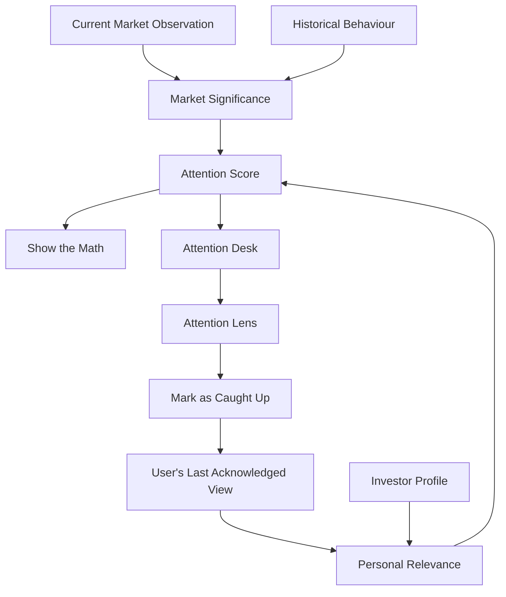
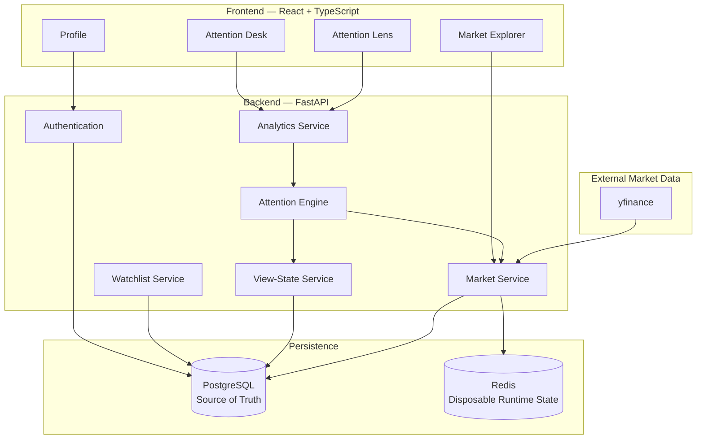
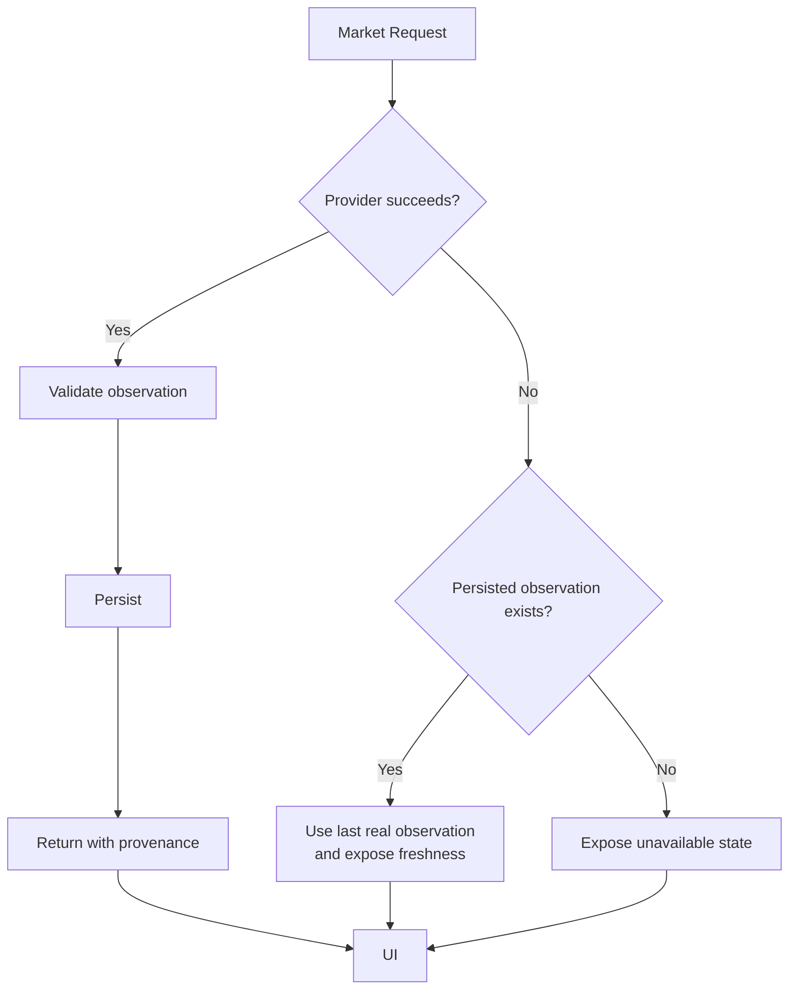
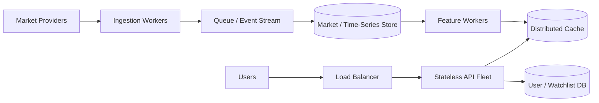

# Smart Watchlist

> **A market watchlist that remembers what you saw, understands what changed, and helps you decide what deserves attention now.**

Traditional watchlists answer:

> **“What is the market doing?”**

Smart Watchlist asks:

> **“What changed meaningfully since I last checked — and which of those changes matter to me?”**

Instead of showing another wall of green and red percentages, Smart Watchlist combines **real market history, historical context, persisted user state, and investor preferences** into an explainable **Attention Score**.

It does not try to predict stocks or recommend trades.

**It helps users decide what deserves another look.**

---

## Requirements

- Git
- Docker Desktop with Docker Compose
- Internet connection for the initial Docker build and market-data access

No separate local installation of Python, Node.js, PostgreSQL, or Redis is required for the recommended Docker setup.

- Docker Desktop: https://www.docker.com/products/docker-desktop/
- Git: https://git-scm.com/downloads

The Docker-based setup is intended to provide the same application environment across macOS, Windows, and Linux hosts supported by Docker Desktop.

---

## Quick Start

```bash
git clone https://github.com/Sanjana-1905/smart-watchlist.git
cd smart-watchlist
cp .env.example .env
docker compose up --build -d
```

Wait for the services to start, then verify them:

```bash
docker compose ps
```

Open:

**http://localhost:5173**

Backend health check:

```bash
curl http://localhost:8000/health
```

The first build may take a few minutes while Docker downloads and builds the required images.

---

## See the Core Idea in 90 Seconds

1. Click **Continue as Momentum Investor**.
2. Explore the **Attention Desk** and its ranked watchlist.
3. Open a company and compare **Today** with **Since You Checked**.
4. Open **Show the Math** to inspect exactly why the stock received its Attention Score.
5. Click **Mark as caught up** and notice that the user's baseline changes while the underlying market history does not.
6. Sign out.
7. Click **Continue as Stability Investor**.
8. Compare how the same market observations can produce different personal relevance for a different investor context.

```text
                   SAME MARKET
                       │
              ┌────────┴────────┐
              │                 │
              ▼                 ▼
      Momentum Investor   Stability Investor
              │                 │
              ▼                 ▼
        Personal context   Personal context
              │                 │
              └────────┬────────┘
                       ▼
              Different attention
```

> **Market facts remain objective. Attention is personal.**

---

## Product Pitch

Smart Watchlist turns a passive stock list into a personalized attention system. Instead of asking users to repeatedly scan prices, it remembers what they last saw and identifies what changed meaningfully since then. Real market observations are persisted with provenance and freshness, while an explainable scoring engine separates objective market significance from personal relevance. Two contrasting investor profiles demonstrate why the same market event can deserve different levels of attention. Users can inspect every signal, explore historical patterns, understand score decomposition, and explicitly mark themselves caught up. The result is a watchlist designed around attention, context, transparency, and responsible decision support.

---

## The Problem

A normal watchlist might show:

```text
RELIANCE      ₹1,322.00      +1.50%
TCS           ₹2,304.00      -0.69%
HDFCBANK        ₹712.10      +0.77%
```

Useful — but the user still has to determine:

- What changed since **I** last checked?
- Is today's movement unusual for this stock?
- Is unusual volume accompanying it?
- Is the stock near an important recent level?
- Does this event matter to **my** investing context?
- Why should one stock receive my attention before another?

That reasoning is normally left entirely to the user.

Smart Watchlist makes it part of the system.

> **A watchlist should optimize for attention, not information density alone.**

---

## Smart Watchlist vs a Traditional Watchlist

| Aspect | Traditional Watchlist | Smart Watchlist |
|---|---|---|
| Primary question | What are my stocks doing? | What deserves my attention now? |
| Comparison baseline | Usually today's reference | Today **and** last acknowledged view |
| Returning-user context | User remembers manually | Persisted per user × stock |
| Historical context | Primarily displayed | Used to interpret current movement |
| Personalization | Mostly organization/display | Separate Personal Relevance layer |
| Ranking | Price/change oriented | Explainable Attention Score |
| Explanation | User interprets numbers | **Show the Math** decomposition |
| Opening a stock | May implicitly count as viewing | Does not mutate the baseline |
| Acknowledgement | Usually absent | Explicit **Mark as caught up** |
| Multi-user state | Same basic market view | Independent profiles and baselines |
| Data uncertainty | Often invisible | Freshness and provenance exposed |

---

## How Smart Watchlist Thinks



The system deliberately separates two questions.

### 1. Is something objectively significant happening?

This produces **Market Significance**.

It uses market behaviour such as:

- price movement,
- movement relative to historical volatility,
- relative volume,
- recent technical context.

### 2. Does it deserve this user's attention?

This produces **Personal Relevance**.

It considers:

- movement since that user last checked,
- the user's investor/attention profile.

Conceptually:

```text
Market Significance
        +
Personal Relevance
        │
        ▼
Raw Attention Score
        │
        ▼
     cap(100)
        │
        ▼
Final Attention Score
```

The backend owns this calculation.

The frontend displays the result and its decomposition; it does not independently redefine the score.

---

## Attention Score

The scoring engine is deliberately **interpretable and deterministic**.

### Objective Market Significance

| Signal | Maximum contribution |
|---|---:|
| Return / unusual movement | 45 |
| Relative volume | 25 |
| Technical / recent-high context | 10 |

The objective component is independent of the user.

For the same market observation:

```text
MarketSignificance(User A)
=
MarketSignificance(User B)
```

### Personal Relevance

| Signal | Maximum contribution |
|---|---:|
| Change since last view | 20 |
| Profile / attention-style fit | 15 |

Conceptually:

```text
objective_score =
    return_contribution
  + volume_contribution
  + technical_contribution

personal_relevance =
    since_last_view_contribution
  + profile_fit_contribution

attention_score =
    min(
        objective_score + personal_relevance,
        100
    )
```

This separation is intentional.

A user's preferences may influence **what deserves their attention**, but they must not rewrite **what happened in the market**.

---

## Why Rules Instead of Machine Learning?

An ML ranking model could combine many more signals.

That does not automatically make it the better engineering choice.

For this problem, introducing ML would also introduce:

- limited meaningful labelled attention data,
- harder explanations,
- harder deterministic testing,
- harder debugging,
- model/version management,
- potentially false sophistication without proven product value.

For a financial attention product, an unexplained score can reduce trust.

The current scoring system is:

```text
deterministic
+ inspectable
+ testable
+ explainable
+ replaceable
```

A future model could assist feature weighting or ranking, but **explainability should remain an invariant**.

---

## “Today” Is Not “Since You Checked”

This distinction is central to the product.

```text
TODAY
+1.50%

SINCE YOU CHECKED
+4.70%
```

They answer different questions.

### Today

Measures the current market/session movement.

### Since You Checked

Measures movement relative to **this user's last acknowledged baseline**.

For:

```text
Current price = C
Last acknowledged price = L
```

the personalized change is:

```text
since_last_view_pct =
    ((C / L) - 1) × 100
```

The baseline is persisted per:

```text
USER × STOCK
```

not globally.

That means two users can have different context for exactly the same market observation.

---

## Why Doesn't Opening a Stock Reset the Baseline?

Because:

```text
Opened a page
      ≠
Acknowledged a change
```

Automatically updating the baseline when the user navigates to a stock would silently destroy useful returning-user context.

Smart Watchlist therefore makes the transition explicit:

```text
Mark as caught up
```

Only then is that user's baseline updated.

```text
Before acknowledgement
last_viewed_price = previous acknowledged observation

User opens Attention Lens
last_viewed_price = unchanged

User clicks "Mark as caught up"
last_viewed_price = latest observation
```

The market history itself is never changed by this action.

---

## Product Surfaces

### Attention Desk

The main dashboard is designed around prioritization rather than a generic portfolio table.

It surfaces:

- attention ranking,
- current price,
- today's movement,
- movement since last check,
- objective market significance,
- personal relevance,
- strongest drivers behind the score.

Quiet stocks remain available without competing visually with higher-attention events.

### Attention Lens

Opening a company provides deeper analytical context, including available historical behaviour, Today vs Since You Checked, volatility, relative volume, recent-high context, freshness, provenance, score decomposition, and acknowledgement state.

The goal is not to maximize the number of charts.

It is to answer:

> **Why is this stock receiving this level of attention?**

### Market Explorer

The Market Explorer is intentionally separate from the user's watchlist.

Users can discover supported companies, search the market catalog, inspect available information, and choose which companies belong in their watchlist.

This is particularly important for new accounts.

A new user should not receive fabricated personalized history simply to make the dashboard look populated.

### Profile

The profile represents the user's attention context and allows the product to distinguish objective market significance from personal relevance.

The profile does not alter historical prices or objective market signals.

---

## New User Experience

A new account has no meaningful last-view history.

Smart Watchlist does not manufacture one.

```text
REGISTER
   │
   ▼
No fabricated personal history
   │
   ▼
MARKET EXPLORER
   │
   ▼
Choose companies
   │
   ▼
WATCHLIST
   │
   ▼
Real user interactions
   │
   ▼
Meaningful personal baselines
```

---

## System Architecture



### Architectural Responsibilities

#### Frontend — React + TypeScript

Responsible for navigation, interaction, visualization, responsive layout, filtering, accessibility, loading/error states, and presentation.

It is **not** the authoritative source for financial calculations.

#### Backend — FastAPI

Owns authentication, watchlist operations, analytics, market observations, user profiles, view state, and Attention Score computation.

Business logic is kept outside UI components and route handlers where possible so it can be independently tested.

#### PostgreSQL — Source of Truth

Durable state belongs in PostgreSQL:

```text
Users
Profiles
Stocks
Watchlist memberships
Price snapshots
Per-user view state
```

Critical user state survives browser refreshes, backend restarts, Redis restarts, and new sessions.

#### Redis — Non-Authoritative Runtime State

Redis is intentionally not the source of truth.

Losing Redis must not destroy watchlists, profiles, market history, or user baselines.

> **Redis may affect performance. It must not affect truth.**

---

## Market Data Pipeline

```mermaid
flowchart LR
    Y["yfinance"]
    --> MAP["Ticker Mapping"]
    --> VALIDATE["Validation"]
    --> NORMALIZE["Normalize OHLCV + Timestamp"]
    --> DEDUP["Deduplicate"]
    --> PG[("PostgreSQL")]
    --> FEATURES["Feature Computation"]
    --> OBJECTIVE["Market Significance"]
    --> PERSONAL["Personal Relevance"]
    --> SCORE["Attention Score"]
    --> API["FastAPI"]
    --> UI["React"]
```



Historical market observations are imported through **yfinance** and persisted rather than existing only in memory.

Provider-specific ticker translation is isolated in:

```text
backend/app/providers/ticker_map.py
```

The application domain therefore understands symbols such as:

```text
ASIANPAINT
RELIANCE
M&M
BAJAJ-AUTO
```

without scattering provider-specific conventions throughout scoring and analytics code.

Changing the provider should therefore not require rewriting the Attention Engine.

---

## Historical Data Import

Historical observations can be imported with:

```bash
docker compose exec -T backend \
  python scripts/import_market_history.py --period 1y
```

A specific supported symbol can also be imported:

```bash
docker compose exec -T backend \
  python scripts/import_market_history.py \
  --symbol ASIANPAINT \
  --period 1y
```

The importer follows:

```text
Resolve provider ticker
        ↓
Fetch observations
        ↓
Validate
        ↓
Normalize timestamp/OHLCV
        ↓
Reject invalid rows
        ↓
Check existing timestamps
        ↓
Persist only new observations
```

It is designed to be safely rerunnable.

---

## Data Provenance & Freshness

A financial number without context can create false confidence.

Persisted observations retain provenance information such as:

```text
observed_at
source
```

The system distinguishes:

```text
REAL DATA
    ≠
FRESH DATA
```

A genuine provider observation may still be old.

That distinction is surfaced rather than hidden.



> **Provider failure must not silently become fabricated market data.**

Smart Watchlist does not claim exchange-grade tick-by-tick real-time data. Freshness depends on the upstream provider and ingestion cadence.

---

## Demo Personas

Two demo identities make personalization easy to inspect.

### Momentum Investor

```text
Email:    demo@smartwatchlist.dev
Password: demo1234
```

### Stability Investor

```text
Email:    demo.stability@smartwatchlist.dev
Password: demo1234
```

The purpose is not to create two different markets:

```text
Same market observations
        +
Different user context
        ↓
Potentially different personal relevance
```

Objective market significance remains market-driven.

---

## Reproducible Demo State

The demo separates **real market history** from **simulated user behaviour**.

```text
Persisted market observations
              +
Controlled user view-state baselines
              ↓
Reproducible returning-user scenario
```

Reset demo user baselines:

```bash
docker compose exec -T backend python scripts/demo.py reset
```

Advance/catch up the demo users:

```bash
docker compose exec -T backend python scripts/demo.py advance
```

The invariant is:

```text
demo state command
       │
       ├── may change user view-state
       │
       └── must NOT rewrite market history
```

---

## Key Engineering Decisions

| Decision | Why | Trade-off |
|---|---|---|
| Attention instead of information density | Directly solves the returning-user problem | Primary UI intentionally shows less |
| Objective + personal score separation | User preference cannot rewrite market facts | Adds domain structure |
| Explainable rules instead of ML | Deterministic, inspectable and testable | Less adaptive than learned ranking |
| PostgreSQL as source of truth | Durable cross-session state | Requires persistent database |
| Redis non-authoritative | Cache failure cannot destroy truth | Some operations may fall back to DB |
| Persist historical observations | Reproducibility and historical context | Additional storage |
| Provider abstraction | External provider does not leak into domain logic | Additional interface/mapping layer |
| Explicit acknowledgement | Navigation should not silently mutate state | Requires one deliberate user action |
| Honest missing/stale states | Avoid fabricated certainty | Some UI states contain less information |
| One primary watchlist | Focused engineering depth on meaningful change | Named-list organization deferred |

---

## Why One Primary Watchlist?

Multiple named lists such as Long Term, Momentum, Banking, or Research would be useful.

But they primarily introduce another organizational layer.

The harder problem chosen for this implementation was:

> **How does the system know what meaningfully changed since a user last checked?**

Engineering effort was therefore concentrated on meaningful-change detection, historical analytics, per-user state, personalization, real market ingestion, resilience, explainability, and explicit state semantics.

Named watchlists are a natural extension of the existing model rather than a requirement for demonstrating the central architecture.

---

## Reliability & Edge Cases

| Situation | Behaviour |
|---|---|
| Market provider fails | Reuse persisted real observation where appropriate and expose freshness |
| No persisted observation exists | Show unavailable state |
| Observation is old | Communicate staleness |
| Historical import runs twice | Deduplication prevents intentional duplicate history |
| Backend restarts | Durable state survives in PostgreSQL |
| Redis restarts | Critical state remains intact |
| New user has no baseline | Do not fabricate personalized history |
| Stock has insufficient history | Do not invent historical analytics |
| User opens a stock | Baseline remains unchanged |
| User marks caught up | Only that user's baseline changes |
| Two users inspect same market event | Objective market significance remains the same |
| Provider ticker differs | Provider mapping handles translation |
| Attention score exceeds range | Final score is capped |
| Personal signal is unavailable | Objective facts remain independently usable |

---

## Architectural Invariants

### 1. Market facts are user-independent

```text
market_fact(User A)
=
market_fact(User B)
```

for the same observation.

### 2. Personal context is user-dependent

```text
personal_relevance(User A)
≠
personal_relevance(User B)
```

when profiles or baselines differ.

### 3. Backend owns scoring

The frontend cannot redefine Attention Score semantics.

### 4. Acknowledgement never mutates market history

```text
Mark as caught up
      ↓
user view state changes

market observations
      ↓
unchanged
```

### 5. Missing information remains missing

The system does not create fake market movement merely to populate a UI.

### 6. Historical ingestion is retry-safe

Repeated imports are designed not to duplicate already-persisted stock/timestamp observations.

---

## Scaling the Architecture

The implementation intentionally avoids premature distributed-system complexity.

Its boundaries nevertheless support a larger deployment.



A naive architecture might fetch the same stock repeatedly for every user watching it.

A scalable model instead separates shared market computation from user-specific relevance:

```text
Unique watched symbols
        │
        ▼
Fetch market state once
        │
        ▼
Persist shared observation
        │
        ▼
Compute shared market features
        │
        ├─────────────────┐
        ▼                 ▼
     User A             User B
        │                 │
personal context     personal context
        │                 │
        ▼                 ▼
attention score     attention score
```

At larger scale, the architecture could add:

- asynchronous ingestion workers,
- queue-backed feature computation,
- distributed scheduling,
- provider rate limiting,
- exponential-backoff retries,
- circuit breakers,
- dedicated time-series storage,
- multi-provider reconciliation,
- stateless API replicas.

These are not introduced prematurely into the current implementation.

---

## Technology Stack

| Layer | Technology |
|---|---|
| Frontend | React |
| Frontend language | TypeScript |
| Build tooling | Vite |
| Backend | FastAPI |
| Backend language | Python |
| ORM | SQLAlchemy |
| Validation | Pydantic |
| Database | PostgreSQL |
| Runtime/cache | Redis |
| Migrations | Alembic |
| Market data | yfinance |
| Authentication | JWT |
| Backend testing | pytest |
| Reproducible environment | Docker Compose |

---

## Running Locally

### Recommended: Docker Compose

From the repository root:

```bash
docker compose up --build -d
```

Check the running services:

```bash
docker compose ps
```

Check backend health:

```bash
curl http://localhost:8000/health
```

Expected shape:

```json
{
  "status": "healthy",
  "components": {
    "database": "healthy",
    "redis": "healthy"
  }
}
```

Open:

**http://localhost:5173**

---

## Verification

### Backend

```bash
docker compose exec -T backend pytest tests -q
```

Verified checkpoint:

```text
115 passed
```

The suite covers authentication, watchlists, analytics, scoring, market ingestion, historical imports, real-market pipeline behaviour, view-state semantics, demo behaviour, and scoring regressions.

### Frontend

The frontend is built and run inside the recommended Docker environment.

For independent local frontend development outside Docker, install the frontend dependencies first:

```bash
npm --prefix frontend ci
npm --prefix frontend run build
```

A local Node.js installation is required only for this non-Docker development workflow.

Verified build:

```text
tsc -b && vite build
✓ built successfully
```

### Repository Hygiene

```bash
git diff --check
git status
```

Verified checkpoint:

```text
git diff --check
→ clean

git status
→ working tree clean
```

---

## Repository Structure

```text
smart-watchlist/
│
├── backend/
│   ├── app/
│   │   ├── api/
│   │   ├── core/
│   │   ├── models/
│   │   ├── providers/
│   │   ├── repositories/
│   │   ├── schemas/
│   │   └── services/
│   │
│   ├── scripts/
│   │   ├── demo.py
│   │   └── import_market_history.py
│   │
│   └── tests/
│
├── frontend/
│   └── src/
│       ├── components/
│       ├── context/
│       ├── pages/
│       ├── services/
│       └── types/
│
├── docker-compose.yml
└── README.md
```

---

## What I Would Build Next

The project deliberately stops before becoming a full trading terminal.

The most natural extensions are:

1. **Multiple Named Watchlists**  
   Organize companies by intent while keeping the Attention Engine unchanged.

2. **Production-Grade Market Provider**  
   Replace or supplement yfinance behind the existing provider abstraction.

3. **Attention Notifications**  
   Notify when an Attention Score crosses a meaningful threshold rather than for every small movement.

4. **Attention History**  
   Preserve when and why a company became important.

5. **Verified Company News**  
   Introduce news only with reliable sourcing, timestamps, provenance, and freshness.

6. **Multi-Provider Reconciliation**  
   Explicitly resolve missing, delayed, conflicting, or unavailable provider observations.

---

## What Smart Watchlist Deliberately Does Not Do

Smart Watchlist is not:

- an order execution platform,
- a stock-price predictor,
- an investment adviser,
- a buy/sell recommendation engine,
- an opaque AI stock picker.

Its responsibility is narrower:

> **Reduce the cognitive cost of returning to a watchlist.**

The Attention Score means:

```text
"This may deserve another look."
```

It does **not** mean:

```text
"Buy this stock."
"Sell this stock."
"This stock will rise."
```

That boundary is deliberate.

---

## Final Perspective

Most watchlists optimize for showing more market information.

Smart Watchlist optimizes for the moment a user returns and asks:

> **“What changed enough that I should look again?”**

It combines:

```text
What happened in the market
            +
How unusual that behaviour is
            +
What this user has already seen
            +
What is relevant to this user
            ↓
       Explainable Attention
```

while keeping **market facts, personalization, state, and provenance explicitly separate**.

> **The market stays objective. The attention layer becomes personal.**